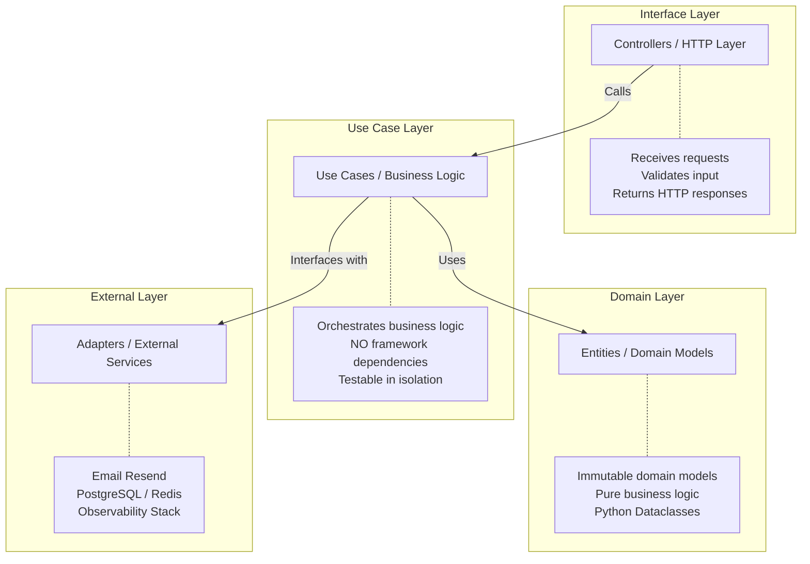

# 🎯 Portfolio Backend API

> **Live API Status:** [Healthy (JSON) →](https://api.argenisbackend.com/health)

REST API built with **FastAPI** and **Clean Architecture** — engineered with a **language-agnostic core** so that the system remains portable, testable, and framework-independent.

## 📝 Description

Professional backend for a developer portfolio, implementing:
- ✅ **Clean Architecture** (Controllers → Use Cases → Entities → Adapters)
- ✅ **Versioned API** (/api/v1/*)
- ✅ **SQL Database** with **SQLModel** (SQLAlchemy + Pydantic)
- ✅ **Database Migrations** with **Alembic**
- ✅ **Global Error Handling** with custom exceptions
- ✅ **Middleware** with request_id, logging, and performance measurement
- ✅ **Professional Health Check** with database connectivity and uptime
- ✅ **Clear separation** of responsibilities
- ✅ **Automatic validation** with Pydantic V2
- ✅ **Interactive Documentation** with OpenAPI/Swagger
- ✅ **Automated Tests** with pytest
- ✅ **Quality Gate**: GitHub Actions enforces a **80% minimum coverage** threshold and verified Docker builds on every push.
- ✅ **Layered contact protection**: `ContactGuard` service orchestrating honeypot, spam scoring, content dedup (Redis → in-memory fallback, 30-min window), and multi-tier rate limiting (10/day email, 20/min email, 30/hour IP, 30/hour fingerprint).
- ✅ **Rate Limiting**: Enforced via slowapi with Redis backend (fails open on Redis outage).
- ✅ **API Observability**: Full integration with OpenTelemetry, Prometheus, and Sentry.
- ✅ **Live Evidence Support**: Built-in Chaos Monkey simulations and real-time metrics for interactive frontend dashboards.

---

## 🏗️ Architecture

### Simplified Clean Architecture


### Request Flow

1. HTTP Request
2. **Middleware**: Assigns `X-Request-ID`, logs entry.
3. **Controller**: Pydantic validation.
4. **Use Case**: Executes business logic.
5. **Adapter**: Interacts with **SQL Database** via **SQLModel**.
6. Returns Response.
7. **Middleware**: Logs exit, adds `X-Request-ID` and `X-Response-Time` headers.

---

## 🚀 How to Run

### 1. Installation
```bash
git clone https://github.com/Argenis1412/portfolio.git
cd portfolio/backend

# Create virtual environment
# Windows:
py -3.12 -m venv .venv
# Linux/macOS:
python -m venv .venv

# Activate virtual environment
# Windows:
.\.venv\Scripts\activate
# Linux/macOS:
source .venv/bin/activate

# Install dependencies
pip install -r requirements.txt
```

### 2. Database Setup (New)
```bash
# 1. Apply schema migrations
python -m alembic upgrade head

# 2. Seed data from JSON to SQL
python ./scripts/migrate_data.py
```

### 3. Execution
```bash
# Start the server
python -m uvicorn app.main:app --reload --port 8000
```
- **Production Docs**: `https://api.argenisbackend.com/docs`
- **Production Status**: `https://api.argenisbackend.com/health`
- **Production Health**: `https://api.argenisbackend.com/health`

---

## 🐒 Living Dashboard (Live Evidence)

This backend is designed to feed an interactive "Living Dashboard" frontend. It includes specific instrumentation for demonstrating backend health under load:

- **Chaos Monkey Simulation**: Triggered via `X-Debug-Mode` header.
  - `simulate-429`: Simulates rate limit threshold hit (returns 429 with `Retry-After`).
  - `simulate-500`: Simulates unexpected internal server error.
- **Real-time API Metrics**: Dedicated endpoint providing a "pulse" of the API (latency P95, requests/24h, errors).
- **Trace Accountability**: Every error response includes a `trace_id` for immediate debugging transparency.

---

## 📊 Observability & Metrics

The API exposes a Prometheus-compatible metrics endpoint at `/metrics`.

> [!IMPORTANT]
> **Security Note**: `/metrics` is **protected by HTTP Basic Auth in production**
> (`METRICS_BASIC_AUTH_USERNAME` / `METRICS_BASIC_AUTH_PASSWORD` env vars).
> It is accessible without authentication only in local / development environments.

Supported metrics:
- `http_requests_total`: Counter of all requests by status code.
- `http_request_duration_seconds`: Response latency (P95/P99).
- `process_cpu_seconds_total`: Resource utilization.

---

## 📡 Endpoints

### 🔍 Health Check & Observability
`GET /health`
Returns status for:
- API connectivity
- **Database connection**
- **External service config (Email: Resend)**
- **Uptime** and versioning.

### 📁 Portfolio Data
- `GET /api/v1/about`: Internationalized "About Me" data.
- `GET /api/v1/projects`: Projects with tags and links.
- `GET /api/v1/stack`: Tech stack by categories.
- `GET /api/v1/experiences`: Professional timeline.
- `GET /api/v1/formation`: Education history.

### 🧪 Live Refactoring Features
- `GET /api/v1/metrics/summary`: Consolidated real-time telemetry for frontend evidence dashboard.
- `ANY /any-endpoint` + `X-Debug-Mode: simulate-429`: Force immediate 429 response.

---

## 🧪 Tests
```bash
# Run all tests
pytest

# With coverage report (HTML)
pytest --cov=app --cov-config=.coveragerc --cov-report=html

# CI/CD Quality Gate (local simulation — must reach 80%)
pytest --cov=app --cov-config=.coveragerc --cov-fail-under=80
```

---

## 🎓 Technical Decisions

### Why SQL Database (SQLModel)?
- **Professionalism**: Real-world apps use SQL for relationships and performance.
- **Robustness**: Typing consistency between database models and Pydantic schemas.
- **Evolution**: **Alembic** allows managed schema changes.
- **Scalability**: Easy migration from SQLite to PostgreSQL by changing the `DATABASE_URL`.

### Future-Ready & Language Agnostic
The **Domain Logic (Use Cases)** is strictly isolated from the framework (FastAPI) and external libraries. This means:
- **Portability**: The business rules could be migrated to another Python framework (like Starlette or Litestar) or even serve as a blueprint for a rewrite in a high-performance language (like Go or Rust) with minimal logic re-engineering.
- **Stability**: Changes in infrastructure (DB, Email, Cloud Provider) only require new **Adapters**, leaving the core logic untouched.

---

## 🗺️ Future Roadmap

This backend is designed to evolve into a full-scale enterprise system:
- **🚀 Advanced Simulation**: Transactional logic for a mock "Financial Ledger" (ACID compliance testing).
- **🔐 Identity Research**: Role-Based Access Control (RBAC) implementation.

### Why Manual JSON Serialization (SQLite Compatibility)?
- SQLite doesn't always have native JSON support in all environments.
- Implemented an adapter layer in `sql_models.py` and `SqlRepository` to handle internationalization (dicts/lists) as TEXT, ensuring extreme reliability across all platforms.
